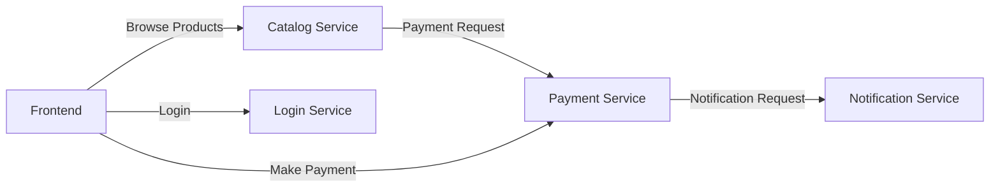

# E-Commerce Microservices Application

A complete microservices-based e-commerce platform built with Spring Boot, featuring user authentication, product catalog, payment processing, and notifications.

## 🏗️ Architecture Overview

```
┌─────────────────┐    ┌─────────────────┐    ┌─────────────────┐    ┌─────────────────┐
│   Login Service │    │ Catalog Service │    │ Payment Service │    │Notification Svc │
│     :8080       │    │     :8081       │    │     :8082       │    │     :8083       │
└─────────────────┘    └─────────────────┘    └─────────────────┘    └─────────────────┘
         │                       │                       │                       │
         └───────────────────────┼───────────────────────┼───────────────────────┘
                                 │                       │
                         ┌───────▼───────┐      ┌────────▼────────┐
                         │  PostgreSQL   │      │   Inter-service │
                         │   Database    │      │  Communication  │
                         │ (Multi-schema)│      │   (REST APIs)   │
                         └───────────────┘      └─────────────────┘
```

## 🚀 Services

### 1. Login Service (Port 8080)
- **Purpose**: User authentication and registration
- **Features**:
  - User registration with validation
  - Login with JWT token generation
  - Password encryption using BCrypt
  - User management APIs
- **Database Schema**: `users_schema`

### 2. Catalog Service (Port 8081)
- **Purpose**: Product catalog management and purchasing
- **Features**:
  - Product listing and search
  - Category-based filtering
  - Stock management
  - Purchase processing (integrates with Payment Service)
- **Database Schema**: `catalog_schema`

### 3. Payment Service (Port 8082)
- **Purpose**: Payment processing simulation
- **Features**:
  - Multiple payment methods (Card, UPI, Net Banking)
  - Payment simulation with success/failure rates
  - Transaction logging
  - Integration with Notification Service
- **Database Schema**: `payment_schema`

### 4. Notification Service (Port 8083)
- **Purpose**: Notification management
- **Features**:
  - Send notifications to users
  - Support for different notification types
  - Notification history tracking
- **Database Schema**: `notification_schema`

## 🛠️ Technology Stack

- **Backend**: Spring Boot 3.2.0, Java 17
- **Database**: PostgreSQL 15
- **Build Tool**: Maven 3.9.6
- **Containerization**: Docker & Docker Compose
- **Frontend**: HTML5, CSS3, JavaScript (Thymeleaf templates)
- **Security**: Spring Security, BCrypt password encoding
- **API Documentation**: OpenAPI/Swagger (optional profile)

## 📋 Prerequisites

- **Java 17** or higher
- **Maven 3.6+**
- **Docker** and **Docker Compose**
- **PostgreSQL 15** (if running locally without Docker)

## 🚀 Quick Start

### Option 1: Docker Compose (Recommended)

1. **Clone the repository**
   ```bash
   git clone <repository-url>
   cd ecommerce-microservices
   ```

2. **Start all services**
   ```bash
   docker-compose up -d
   ```

3. **Verify services are running**
   ```bash
   docker-compose ps
   ```

4. **Access the application**
   - Login Service: http://localhost:8080
   - Catalog Service: http://localhost:8081
   - Payment Service: http://localhost:8082
   - Notification Service: http://localhost:8083

### Option 2: Local Development

1. **Start PostgreSQL**
   ```bash
   docker run --name ecommerce-postgres \
     -e POSTGRES_DB=ecommerce_db \
     -e POSTGRES_USER=postgres \
     -e POSTGRES_PASSWORD=postgres \
     -p 5432:5432 \
     -v $(pwd)/sql/init-database.sql:/docker-entrypoint-initdb.d/init-database.sql \
     postgres:15-alpine
   ```

2. **Build and run each service**
   ```bash
   # Login Service
   cd loginservice
   mvn spring-boot:run

   # Catalog Service
   cd catalog-service
   mvn spring-boot:run

   # Payment Service
   cd payment-service
   mvn spring-boot:run

   # Notification Service
   cd notification-service
   mvn spring-boot:run
   ```

## 🗄️ Database Schema

The application uses a single PostgreSQL database with multiple schemas:

- **users_schema**: User accounts and authentication
- **catalog_schema**: Product catalog and inventory
- **payment_schema**: Transaction records
- **notification_schema**: Notification history

### Default Test Data

**Users** (Password: `password123` for all):
- `admin` / `admin@example.com`
- `user1` / `user1@example.com`
- `demo` / `demo@example.com`

**Products**: 8 sample products across different categories

## 🔧 Configuration

### Environment Variables

Each service supports the following environment variables:

```bash
# Database Configuration
DB_HOST=localhost
DB_PORT=5432
DB_NAME=ecommerce_db
DB_USERNAME=postgres
DB_PASSWORD=postgres

# Service-specific schema
DB_SCHEMA=users_schema    # Login Service
DB_SCHEMA=catalog_schema  # Catalog Service
DB_SCHEMA=payment_schema  # Payment Service
DB_SCHEMA=notification_schema # Notification Service

# Inter-service URLs
PAYMENT_SERVICE_URL=http://payment-service:8082
NOTIFICATION_SERVICE_URL=http://notification-service:8083
```

### Application Profiles

- **dev** (default): Development configuration
- **test**: Testing with H2 database and Testcontainers
- **prod**: Production optimizations
- **docs**: Enables OpenAPI/Swagger documentation

## 🧪 Testing

### Run Unit Tests
```bash
mvn test
```

### Run Integration Tests
```bash
mvn verify
```

### Test with Different Profiles
```bash
mvn test -Ptest
mvn verify -Pprod
```

## 📱 User Journey

1. **Registration/Login**: Start at http://localhost:8080
   - Register a new account or login with demo credentials
   - Receive JWT token upon successful authentication

2. **Browse Products**: Redirected to http://localhost:8081
   - View product catalog
   - Filter by categories
   - Check product details and stock

3. **Purchase Flow**: Click "Buy Now" on any product
   - Redirected to payment service at http://localhost:8082
   - Choose payment method (Card/UPI/Net Banking)
   - Complete payment simulation

4. **Notifications**: Payment notifications sent automatically
   - View at http://localhost:8083
   - Check notification history

## 🔐 Security Features

- **Password Encryption**: BCrypt hashing for user passwords
- **JWT Tokens**: Secure authentication between services
- **Input Validation**: Bean validation on all DTOs
- **CORS Configuration**: Configurable cross-origin requests
- **SQL Injection Prevention**: JPA/Hibernate parameterized queries

## 📊 Monitoring & Health Checks

Each service exposes Actuator endpoints:

- **Health**: `/actuator/health`
- **Metrics**: `/actuator/metrics`
- **Info**: `/actuator/info`

Service-specific endpoints:
- Login Service: `/api/health`
- Catalog Service: `/api/stats`
- Payment Service: `/api/status`
- Notification Service: `/api/stats`

## 🐳 Docker Support

### Individual Service Images
```bash
# Build individual images
docker build -t login-service:2.0.0 ./loginservice
docker build -t catalog-service:2.0.0 ./catalog-service
docker build -t payment-service:2.0.0 ./payment-service
docker build -t notification-service:2.0.0 ./notification-service
```

### Multi-stage Builds
All Dockerfiles use multi-stage builds for optimized image sizes:
- **Build stage**: Maven with OpenJDK 17
- **Runtime stage**: Slim OpenJDK 17 for reduced footprint

## 🔄 Inter-Service Communication



## 🚨 Troubleshooting

### Common Issues

1. **Port Conflicts**
   ```bash
   # Check if ports are in use
   netstat -tlnp | grep :8080
   
   # Stop conflicting services
   docker-compose down
   ```

2. **Database Connection Issues**
   ```bash
   # Check PostgreSQL status
   docker-compose logs postgres
   
   # Reset database
   docker-compose down -v
   docker-compose up -d
   ```

3. **Service Communication Failures**
   ```bash
   # Check service logs
   docker-compose logs catalog-service
   docker-compose logs payment-service
   
   # Verify network connectivity
   docker-compose exec catalog-service ping payment-service
   ```

### Debug Mode

Enable debug logging by setting:
```properties
logging.level.com.example=DEBUG
logging.level.org.springframework.web=DEBUG
```

## 🚀 Production Deployment

### Performance Optimizations

1. **Enable Production Profile**
   ```bash
   export SPRING_PROFILES_ACTIVE=prod
   ```

2. **JVM Tuning**
   ```bash
   export JAVA_OPTS="-Xmx1g -Xms512m -XX:+UseG1GC"
   ```

3. **Database Connection Pooling**
   ```properties
   spring.datasource.hikari.maximum-pool-size=20
   spring.datasource.hikari.minimum-idle=5
   ```

### Security Hardening

1. **Change Default Passwords**
2. **Enable HTTPS**
3. **Configure Firewall Rules**
4. **Set up Database Access Controls**
5. **Enable Audit Logging**

## 📚 API Documentation

When running with the `docs` profile, Swagger UI is available at:
- Login Service: http://localhost:8080/swagger-ui.html
- Catalog Service: http://localhost:8081/swagger-ui.html
- Payment Service: http://localhost:8082/swagger-ui.html
- Notification Service: http://localhost:8083/swagger-ui.html

## 🤝 Contributing

1. Fork the repository
2. Create a feature branch (`git checkout -b feature/amazing-feature`)
3. Commit your changes (`git commit -m 'Add amazing feature'`)
4. Push to the branch (`git push origin feature/amazing-feature`)
5. Open a Pull Request

## 📄 License

This project is licensed under the MIT License - see the [LICENSE](LICENSE) file for details.

## 📞 Support

For questions and support:
- Create an issue in the GitHub repository
- Check the troubleshooting section above
- Review service logs for detailed error information

## 🗺️ Roadmap

- [ ] Kubernetes deployment manifests
- [ ] Service mesh integration (Istio)
- [ ] Monitoring with Prometheus/Grafana
- [ ] Centralized logging with ELK stack
- [ ] API Gateway implementation
- [ ] Circuit breaker patterns
- [ ] Distributed tracing
- [ ] Event-driven architecture with Kafka

---

**Happy Coding! 🎉**
